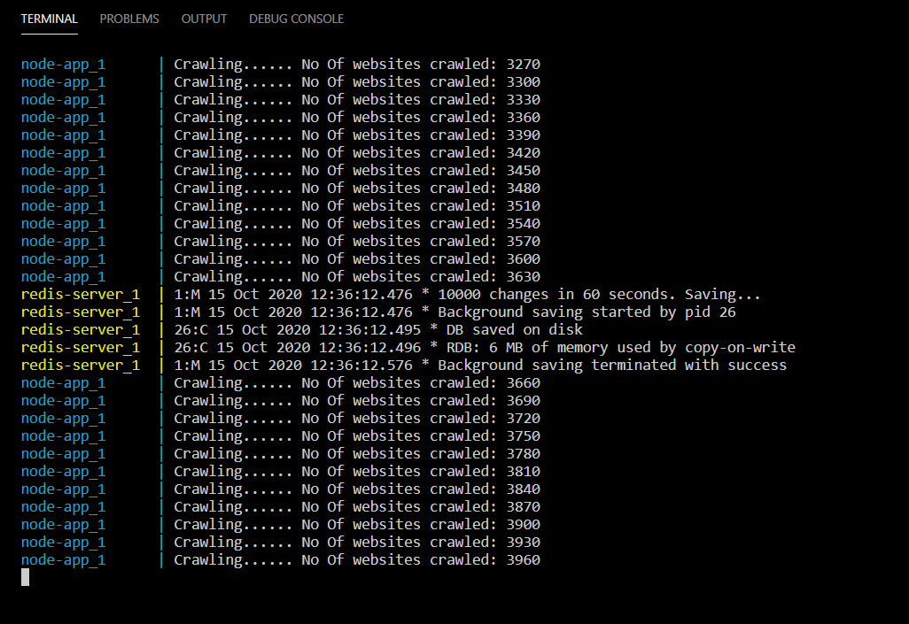

# RecursiveWebCrawler

Recursively crawls a website and stores all unique urls, number of times it has been referenced and parameters associated with it in Redis. Crawling happens asynchronously and concurrently through 5 channels.

## Preview



---

### Built With
- NodeJs
- Redis
- Docker

---

## Getting Started

To get a local copy up and running follow these simple example steps.

### Preqrequisites

- Docker   
    - [Dowload and Install](https://www.docker.com/products/docker-desktop) Docker for running this web app.
- Clone this repo to your local machine.
- In `config.js`, change configurations according to your preferance.
    - 

### Usage
- To run the web app, simply paste the following code in your terminal.
    ```bash
    docker-compose up
    ```
- Wait for crawling to finish and have fun 😊.
- To view saved info in Redis
    ```powershell
    docker ps # select the name of redis server created by this web app, something like this - recursivewebcrawler_redis-server_1

    docker exec -it recursivewebcrawler_redis-server_1 redis-cli

    # Use Redis commands to explore saved data
    KEYS * # Get all keys
    
    ```
- To exit the web app, simply paste the following code in your terminal.
    ```bash
    docker-compose down
    ```


---

## Author
- RapiDash1